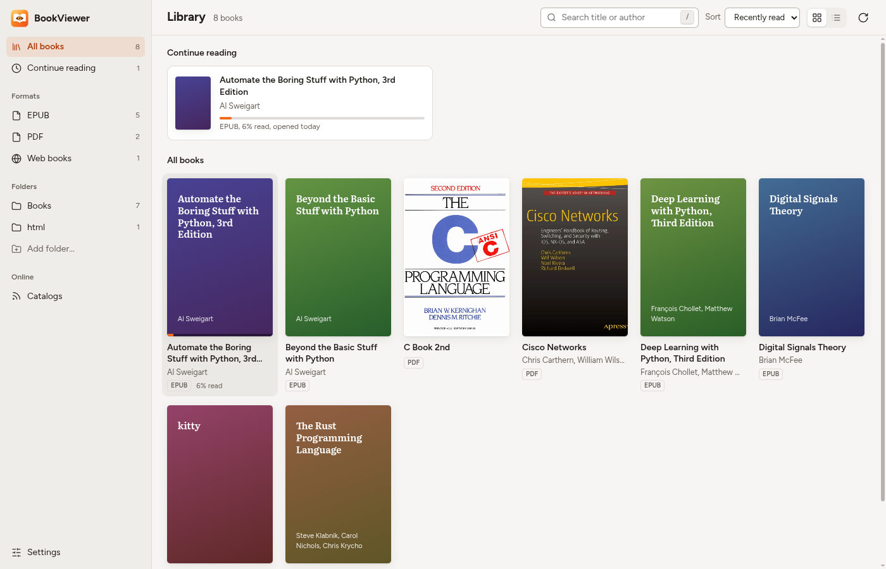
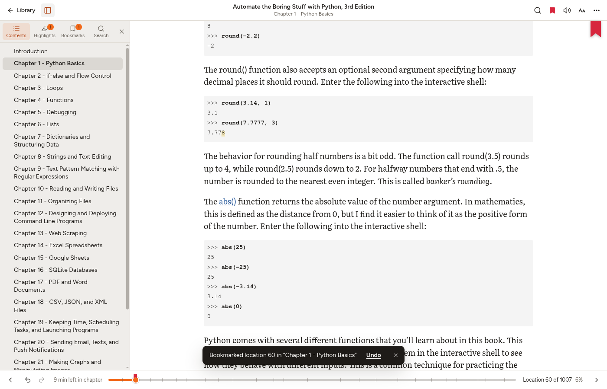
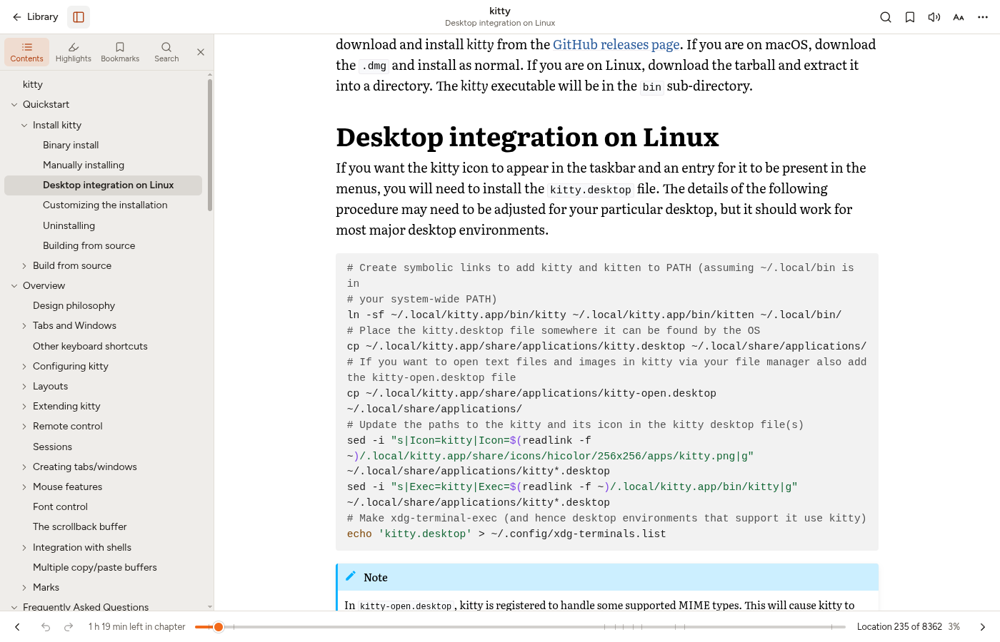
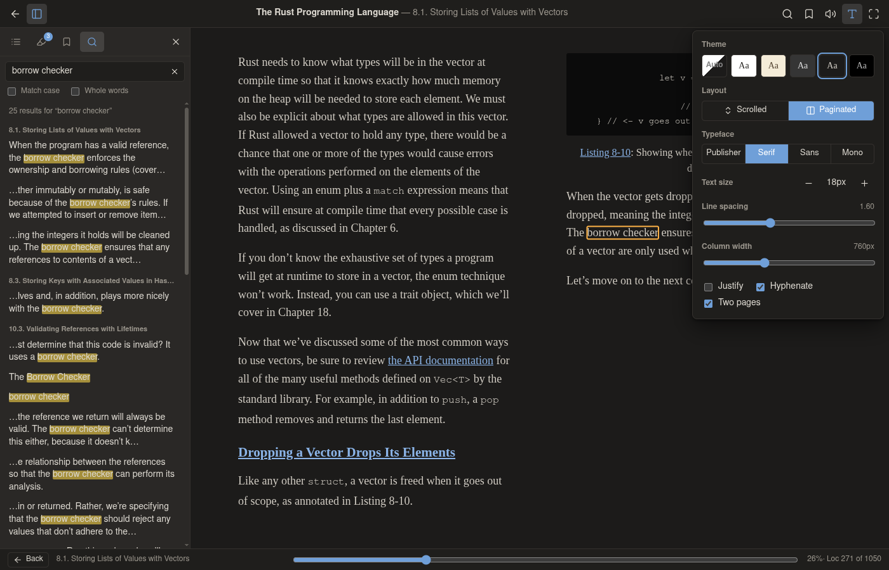
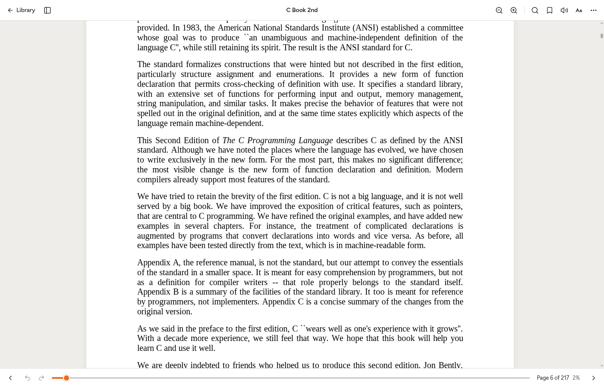

# BookViewer

A desktop library and reader for e-books **and** for books saved from the web.
Point it at a folder and it indexes the EPUB, MOBI/AZW3, FB2, CBZ and PDF files
in it, plus any HTML books saved there (mdBook, Sphinx, Jupyter Book, MkDocs,
Docusaurus, or just a folder of pages), and reads all of them in one continuous
vertical scroll with highlights, notes, search, lookup and read-aloud.



| | |
|---|---|
|  |  |
|  |  |

## Features

- **Library** – add folders; they are scanned and watched for changes. Covers
  come from the book (EPUB cover, first PDF page, a site's `og:image`); books
  without one get a generated title card. Sort, filter by format or folder,
  search by title/author, grid or list. Books in progress sit on a "Continue
  reading" shelf at the top; each book's menu has its details and marks it
  finished or unread.
- **Continuous scroll** – chapters (and the pages of an HTML book) are stitched
  into a single column; nothing to click at chapter ends. A paginated,
  two-page layout is one toggle away.
- **HTML books as books** – a saved site is detected by its generator's
  fingerprints, its page order and table of contents are read from the site's
  own navigation (following "next" links where the index only lists top-level
  sections), and pages are shown without sidebars, headers or scripts.
- **Math** – TeX left in the text (`\( … \)`, `\[ … \]`, `$$ … $$`), which is
  what Sphinx/Jupyter Book pages and EPUBs converted from them contain, is
  rendered with MathJax.
- **Highlights and notes** in five colours and four styles, for EPUB, HTML and
  PDF alike. They are anchored by EPUB CFI / PDF rectangles *and* by the quoted
  text, so they survive a book being re-saved or re-converted. Export to
  Markdown or JSON.
- **Bookmarks** – a red ribbon marks a bookmarked page, a notice says which
  page was bookmarked and offers Undo, and bookmarks show as marks along the
  progress bar.
- **Finding your way** – every book reopens where you stopped. The bottom bar
  has previous/next, back and forward after a jump, a progress bar with chapter
  marks that previews where a jump lands, "go to page", and the reading time
  left in the chapter.
- **Search** inside a book, with results listed by chapter.
- **Lookup** – dictionary (Free Dictionary API, Wiktionary) and Wikipedia
  popovers for the selection; a translate action opens Google Translate.
- **Read aloud** – sentence by sentence with the text highlighted as it goes.
  Uses the system voices when Chromium has them (speech-dispatcher), otherwise
  `espeak-ng`, or [Piper](https://github.com/OHF-Voice/piper1-gpl) if configured.
- **Themes** – light, sepia, gray, dark, black (or follow the system); font,
  size, line spacing, column width, justification, hyphenation.
- **OPDS** catalogs – browse and download into a library folder.
- **Offline dictionaries** – StarDict dictionaries in a folder you choose
  (Settings) are used for "Define" before any online lookup.
- **Add from a web address** – paste the URL of an online book (its contents
  page), a single article, or a PDF/e-book file; it is saved into a library
  folder and read offline like any other book.

## Running it

```sh
git clone --recurse-submodules <this repository>
cd BookViewer
npm install
npm run dev        # development, with hot reload
npm run build && npm start   # production build, run in place
```

`vendor/foliate-js` is a git submodule (upstream publishes no npm package);
if you cloned without `--recurse-submodules`, run `git submodule update --init`.

Requires Node 22.12 or newer. For read-aloud install `espeak-ng`.

### Tests

```sh
npm test           # unit tests (vitest): anchoring, CFIs, scanner, database, …
npm run test:e2e   # builds, then drives the real app with Playwright
npm run typecheck
```

`scripts/scenarios/ui-tour.mjs` screenshots every screen in two themes (and
checks accessibility with `AXE=1`); `scripts/scenarios/readme-shots.mjs` retakes
the pictures above. Both run through `node scripts/drive.mjs <scenario>`.

The end-to-end test starts Electron on Chromium's headless display backend, so
no window appears; `HEADED=1 npm run test:e2e` shows it.

### Packages

```sh
npm run dist       # AppImage, .deb and .pacman in dist/
```

For Arch-based systems there is also `packaging/arch/PKGBUILD`, which builds
against the system `electron` package instead of bundling one
(`cd packaging/arch && makepkg -si`).

## Keyboard

| Key | Action |
|---|---|
| `→` `PageDown` `Space` | next page / screen |
| `←` `PageUp` `Shift+Space` | previous page / screen |
| `↓` `↑` or `j` `k` | scroll a little |
| `Home` `End` | start / end of the book |
| `Ctrl+G` | go to a page |
| `Alt+←` `Alt+→` | back / forward after a jump; `Alt+←` with nothing to go back to returns to the library |
| `Ctrl+F` or `/` | search (in the book, or in the library) |
| `Enter` `Shift+Enter` | next / previous search result |
| `Ctrl+D` | bookmark this page, or remove its bookmark |
| `Ctrl+Z` | undo, while a notice offers it |
| `T` | contents panel |
| `Ctrl +` `Ctrl -` `Ctrl 0` | text size; zoom in a PDF |
| `Ctrl+wheel` | zoom (PDF) |
| `F11` | full screen |
| `Esc` | close whatever is open / leave full screen |
| `F6` | between the book's text and the toolbar |
| `←` `→` `↑` `↓` in the library | move between books |
| `?` | list of shortcuts |

## How it is put together

```
src/main/        Electron main process
  index.ts         window, navigation guards, lifecycle
  db.ts            SQLite (better-sqlite3): folders, books, annotations, bookmarks, settings
  library.ts       folder scanning and watching
  webbook.ts       recognising saved sites; page order and contents from their navigation
  protocol.ts      book:// (book files, with range requests) and app:// (the UI)
  covers.ts lookup.ts tts.ts opds.ts ipc.ts
src/preload/     the one bridge function exposed to the UI
src/shared/      types shared by both sides, including the IPC contract
src/renderer/    the UI (Svelte 5)
  Library/         grid, metadata/cover extraction queue, OPDS browser
  Reader/          reader shell, side panel, popovers, read-aloud
  engines/
    epub.ts          everything reflowable, on top of foliate-js "book" objects
    scroller.ts      the continuous-scroll renderer
    webbook.ts       saved sites presented as foliate books; webpage.ts strips pages to content
    pdf.ts           pdf.js viewer plus our highlight overlays
    math.ts cfi.ts   MathJax rendering that leaves anchors intact
    appearance.ts    themes and typography
  annotations/     text anchoring, the store, export
vendor/foliate-js  book parsers, paginator, CFI, overlayer (git submodule)
```

A few decisions worth knowing about:

- **The UI never touches the filesystem.** It is sandboxed and loads book
  content through `book://b<id>/…`, which only serves the book's own file or
  directory. Metadata and covers are extracted in the renderer (that is where
  the format parsers and a canvas are) and handed to the main process to store.
- **Book content cannot run code or reach the network.** It is rendered in
  `blob:` iframes that inherit the app's Content-Security-Policy; scripts are
  stripped or blocked, and remote images/fonts are not loaded. MathJax and
  syntax highlighting run in the app, not in the book's frame.
- **Dark themes invert** the rendered page (and re-invert photographs) instead
  of overriding colours element by element, which keeps publisher styling,
  syntax colouring and diagrams legible.
- **Anchors are layered.** A highlight stores a CFI (or PDF rectangles) plus
  the quoted text with some context; if the CFI no longer lands on that text,
  the quote is searched for instead.
- **Web books are re-read only when they change**; the manifest (page order,
  contents) is cached in the database.

Data lives in Electron's `userData` directory (`~/.config/BookViewer`):
`library.db` and a `covers/` cache. Set `BOOKVIEWER_USER_DATA` to use another
location. Removing a folder from the library never touches the files in it.

## Not there yet

- MOBI/AZW3 go through the same foliate-js code path as EPUB but have not been
  tested against real files here.
- A PDF highlight is limited to one page; selections spanning pages are cut at
  the page end.
- Offline dictionaries (StarDict) and choosing the lookup/translation
  languages in the UI.
- Opening a file directly (file associations); books are opened from the
  library.
- Only Linux packaging is set up.

## Licence

[MIT](LICENSE). Bundled third-party code keeps its own licence: foliate-js
(MIT), PDF.js and MathJax (Apache-2.0), highlight.js (BSD-3-Clause), zip.js
(BSD-3-Clause).
